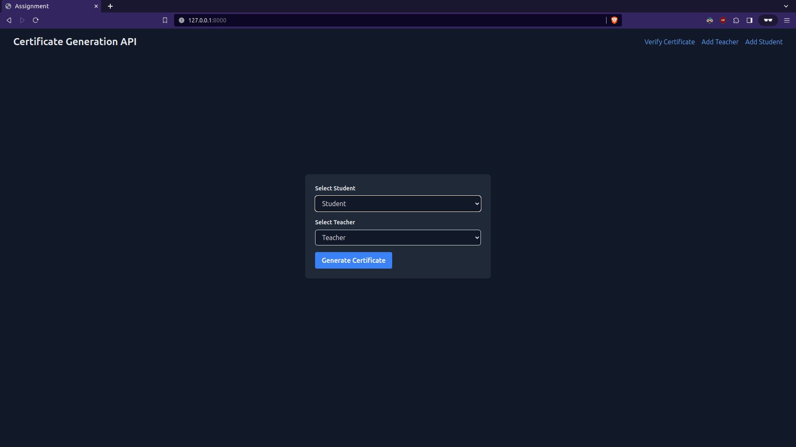

## Assignment for prishni

**Problem Statement**
```
Please implement this assignment using Django. 
    
The assignment has 3 levels :

    1. There is many to many relationship 
    students and teachers. Store their data in the
    tables. if a teacher is selected 
    corresponding students will be displayed and 
    the students are selected then the 
    teachers should be displayed.
    
    2. On Choosing the teacher and a student pair.
    Generate the certificate
    
    3. Verfly the certificate using JWT token
```

just use `docker compose up` to run the project

default port is 80
default credintials are
```
username: admin
password: admin
```

**To run on local machine without docker**

run the following commands in the app directory

`pip install -r requirements.txt`

`python manage.py runserver`

**Screeshot**

These screenshot are in sequence of usage

***Login***


***Login Form***


***Home Page***


***Add Teacher***


***Add Student***


***Select Pair of Student and Teacher to generate Certificate***


***Verify Certificate***


***Certificate***

